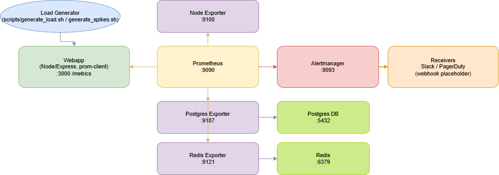

# Prometheus Alert Tuning Lab (Linux)

This directory contains a Proof of Concept (PoC) environment to simulate, analyze, and tune Prometheus alerts.

## Objective
- Analyze the last 3 months of Prometheus alerts (production or simulated).
- Identify the Top 10 alerts that fire but require no action (noise).
- Tune them to reduce alert fatigue while keeping actionable signals.
- Document the process, results, and operating guidelines for sharing on GitHub.

## Prerequisites
- **Docker** and **Docker Compose** must be installed on your Linux machine.
- **curl** (usually pre-installed).

## Architecture
- Editable diagram: [docs/architecture.drawio](file:///c:/Users/LENOVO/Downloads/prometheus-log-audit/docs/architecture.drawio)
- Image preview:



## Setup & Run

1.  **Start the Environment:**
    Open a terminal in this directory and run:
    ```bash
    docker compose up -d
    ```

2.  **Make Scripts Executable:**
    ```bash
    chmod +x scripts/*.sh
    ```

3.  **Generate Data (Noise):**
    Run the load generator:
    ```bash
    ./scripts/generate_load.sh
    ```
    (Optional) In another terminal, generate spikes:
    ```bash
    ./scripts/generate_spikes.sh
    ```

4.  **Access Dashboards:**
    - **Prometheus:** [http://localhost:9090](http://localhost:9090)
    - **Alertmanager:** [http://localhost:9093](http://localhost:9093)
    - **App Metrics:** [http://localhost:3000/metrics](http://localhost:3000/metrics)

## Workflow

1.  **Logs → Analysis → Findings → Tuning → Report**
    - Logs: collect and query alert history from Prometheus TSDB
    - Analysis: run PromQL to quantify firing frequency and durations
    - Findings: identify Top 10 noisy alerts (no action required)
    - Tuning: adjust thresholds, durations, exclusions, and routing
    - Report: document changes, impact, and next steps

2.  **Analyze Noise (Baseline):**
    Go to Prometheus -> Graph and run:
    ```promql
    count by (alertname) (ALERTS{alertstate="firing"})
    ```
    Or:
    ```promql
    topk(10, count by (alertname) (ALERTS{alertstate="firing"}))
    ```
    On environments with long retention (≥90d):
    ```promql
    topk(10, sum by (alertname) (count_over_time(ALERTS{alertstate="firing"}[90d])))
    ```
    This surfaces high-volume, low-value alerts (e.g., `HighResponseTime` including known slow routes, `RedisMemoryHigh` on LRU caches).

3.  **Export Data:**
    Run the export script to save current alert snapshot:
    ```bash
    ./scripts/export_alerts.sh
    ```
    The JSON contains active alerts with labels, annotations, and values.
    Example API (direct):
    ```bash
    curl -s "http://<prometheus-host>:9090/api/v1/alerts"
    ```

4.  **Data-driven Historical Audit (90d)**
    Use PromQL with the HTTP API to compute Top 10 over historical logs:
    ```bash
    curl -s "http://<prometheus-host>:9090/api/v1/query?query=topk(10,%20sum%20by%20(alertname)%20(count_over_time(ALERTS%7Balertstate%3D%22firing%22%7D[90d])))" > audit_top10_90d.json
    ```
    If retention < 90d, adapt the window (e.g., 30d):
    ```bash
    curl -s "http://<prometheus-host>:9090/api/v1/query?query=topk(10,%20sum%20by%20(alertname)%20(count_over_time(ALERTS%7Balertstate%3D%22firing%22%7D[30d])))" > audit_top10_30d.json
    ```
    Optional: group by team
    ```bash
    curl -s "http://<prometheus-host>:9090/api/v1/query?query=topk(10,%20sum%20by%20(alertname,%20team)%20(count_over_time(ALERTS%7Balertstate%3D%22firing%22%7D[90d])))" > audit_top10_team_90d.json
    ```
    These outputs provide a data-driven ranking of noisy alerts to target for tuning.
    Script helper:
    ```bash
    chmod +x scripts/audit_historical.sh
    ./scripts/audit_historical.sh <prometheus-host:9090> 30d
    ```
    Extrapolation tip when simulating short windows: measure over N hours and scale by (30*24)/N to approximate monthly volumes.

5.  **Tune Alerts:**
    Use `prometheus/alerts_tuned.yml` as a reference for professional tuning:
    - Exclude known slow endpoints from latency SLO (e.g., `/slow`) to avoid expected noise.
    - Increase thresholds and `for:` durations on CPU/Mem to ignore transient spikes. For CPU, set `> 85` with `for: 5m`.
    - Raise pool-based limits (DB connections) according to realistic capacity.
    - Disable purely informative alerts (e.g., Redis memory fullness under LRU).
    - Keep actionable signals (e.g., `RedisDown`) intact.
    Apply changes by editing `prometheus/alerts.yml` or swapping to `alerts_tuned.yml`, then:
    Restart Prometheus to apply changes:
    ```bash
    docker compose restart prometheus
    ```

4.  **Stop Environment:**
    ```bash
    docker compose down
    ```

## Executed Scenario (For Audit)
- Stack deployed via Docker Compose.
- Baseline load applied: `./scripts/generate_load.sh`.
- Baseline alert snapshot exported: `./scripts/export_alerts.sh`.
- Alert rules tuned using `prometheus/alerts_tuned.yml`.
- Increased load/spikes applied: `./scripts/generate_spikes.sh`.
- Post-tuning alert snapshot exported: `./scripts/export_alerts.sh`.

To compare snapshots (optional with jq):
```bash
jq '.data.alerts | group_by(.labels.alertname) | map({name: .[0].labels.alertname, count: length}) | sort_by(.count) | reverse' alert_analysis_*.json
```

## Key Tuning Details
- HighResponseTime:
  - Old: p95 includes `/slow` → frequent noise.
  - New: `histogram_quantile(0.95, rate(http_request_duration_seconds_bucket{route!="/slow"}[5m])) > 0.5` with longer `for`.
- RedisMemoryHigh:
  - Disabled for LRU cache setups; monitor `up{job="redis"} == 0` and eviction rates instead.
- LowCacheHitRate:
  - Converted to dashboard-only metric or increased `for` to avoid warm-up noise.
- System thresholds (CPU/Mem/Disk):
  - Increased to reflect modern usage; added longer `for` windows to ignore short spikes.
- Database connections:
  - Threshold raised to align with pool capacity (e.g., 45).

See tuned rules: [alerts_tuned.yml](prometheus-log-audit/prometheus/alerts_tuned.yml)
Original rules: [alerts.yml](prometheus-log-audit/prometheus/alerts.yml)

## Validation
- Verify that actionable alerts remain (e.g., `RedisDown`), while noisy ones no longer page.
- Re-run baseline queries:
  ```promql
  count by (alertname) (ALERTS{alertstate="firing"})
  ```
  Compare pre/post volume and composition of alerts.
- Inspect Alertmanager UI: grouping, routing, inhibition behavior.

## Alertmanager Routing & Slack (Optional)
- Current routing: [alertmanager.yml](prometheus-log-audit/alertmanager/alertmanager.yml)
  - `severity=critical` → `pagerduty-critical` (webhook placeholder).
  - `severity=warning` → `slack-notifications` (webhook placeholder).
- To send to real Slack, configure `slack_configs`:
```yaml
receivers:
  - name: 'slack-notifications'
    slack_configs:
      - api_url: 'https://hooks.slack.com/services/XXX/YYY/ZZZ'
        channel: '#alerts'
        send_resolved: true
        title: '{{ .CommonAnnotations.summary }}'
        text: >-
          Alert: {{ .CommonLabels.alertname }}
          Severity: {{ .CommonLabels.severity }}
          Instance: {{ .CommonLabels.instance }}
          Description: {{ .CommonAnnotations.description }}
```
Restart Alertmanager after changes.

## Repository Structure (GitHub)
- `app/`: Sample service exposing Prometheus metrics ([server.js](prometheus-log-audit/app/server.js)).
- `prometheus/`: Scrape configs and alert rules (original and tuned).
- `alertmanager/`: Routing, receivers, inhibition settings.
- `scripts/`: Load generation, spikes, alert export helpers.
- `docker-compose.yml`: Orchestration for the full stack.
- `AUDIT_REPORT.md`: Executive summary and tuning rationale.

## Professional Guidance
- Keep TSDB retention aligned with audit windows (≥90d) for quarterly analyses.
- Adopt SLO-based alerting; exclude known benign behaviors from paging rules.
- Prefer longer `for` durations for noisy signals; rely on dashboards for informational metrics.
- Review routing and inhibition regularly to avoid duplicate or low-value notifications.
- Validate changes in staging for 24h before promotion to production.

## References
- Prometheus UI: http://localhost:9090
- Alertmanager UI: http://localhost:9093
- Metrics endpoint: http://localhost:3000/metrics
- Baseline/tuned rules: [alerts.yml](prometheus-log-audit/prometheus/alerts.yml), [alerts_tuned.yml](prometheus-log-audit/prometheus/alerts_tuned.yml)
